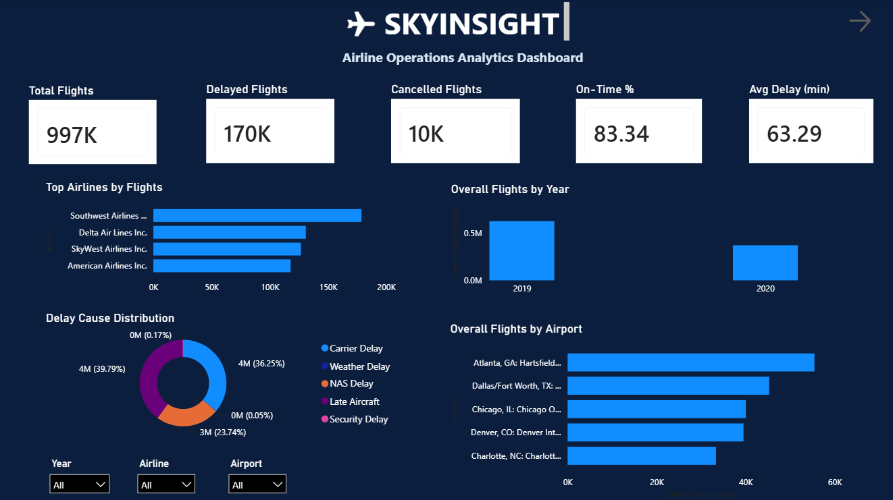
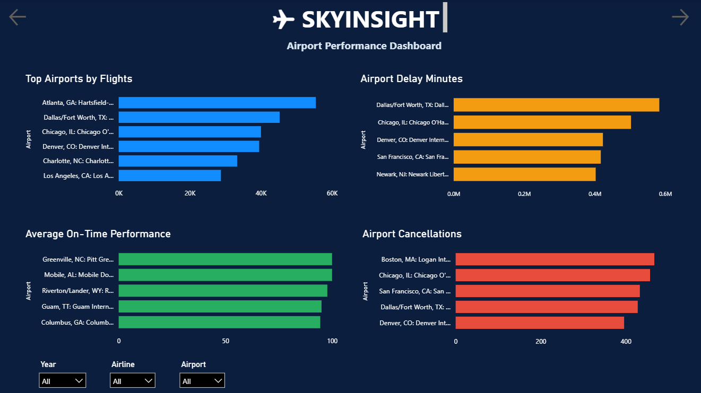
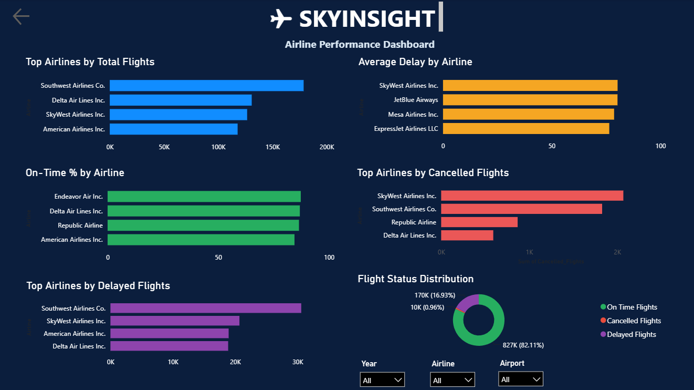

# ✈️ SkyInsight – Airline Operations Analytics Dashboard


SkyInsight is an end-to-end Airline Operations Analytics project that transforms raw airline operational data into actionable business insights using Python, SQL, and Power BI.

The project follows a complete analytics workflow including data cleaning, exploratory data analysis, SQL querying, and interactive dashboard development to analyze airline performance, airport efficiency, flight delays, and cancellations.

---

## Project Overview

The aviation industry generates massive operational data every day. Understanding this data helps airlines improve punctuality, reduce delays, optimize airport operations, and enhance customer satisfaction.

SkyInsight provides an interactive analytics dashboard that enables users to explore airline operations through multiple perspectives.

---

## Project Demo

A short walkthrough demonstrating the interactive Power BI dashboard.

**[Watch Demo Video](Demo/SkyInsight_Demo.mp4)**

---

## Objectives

- Analyze airline operational performance
- Identify delay patterns and major delay causes
- Evaluate airport performance
- Compare airline efficiency
- Measure on-time performance
- Analyze flight cancellations
- Build an interactive business intelligence dashboard

---

## Tech Stack

| Category | Technologies |
|----------|--------------|
| Programming | Python |
| Data Analysis | Pandas, NumPy |
| Visualization | Matplotlib |
| Notebook | Jupyter Notebook |
| Database | SQL |
| Dashboard | Power BI |

---

## Project Structure

```
SkyInsight-Airline-Operations
│
├── Dashboard_images
│   ├── Executive_Overview_Dashboard.png
│   ├── Airport_Performance_Dashboard.png
│   └── Airline_Performance_Dashboard.png
│
├── Demo
│   └── SkyInsight_Demo.mp4
│
├── Dataset
│   ├── airline_operations.csv
│   └── airline_operations_cleaned.csv
│
├── Notebooks
│   ├── 01_Data_Cleaning.ipynb
│   └── 02_EDA.ipynb
│
├── PowerBI
│   └── SkyInsight_Airline_Analytics.pbix
│
├── SQL
│   └── airline_queries.sql
│
└── README.md
```

---

## Project Workflow

```
Raw Dataset
      │
      ▼
Data Cleaning (Python)
      │
      ▼
Exploratory Data Analysis
      │
      ▼
SQL Analysis
      │
      ▼
Power BI Dashboard
      │
      ▼
Business Insights
```

---

# Power BI Dashboard

The Power BI dashboard consists of three interactive pages that allow users to analyze airline operations from multiple business perspectives.

Features include:

- Interactive slicers
- KPI Cards
- Dynamic Charts
- Airport Analysis
- Airline Comparison
- Delay Analysis
- Cancellation Analysis
- On-Time Performance Metrics

Power BI File:

**[Download Power BI Dashboard](PowerBI/SkyInsight_Airline_Analytics.pbix)**

---

## Dashboard Pages

## 1️⃣ Executive Overview

Provides a high-level summary of airline operations including:

- Total Flights
- Delayed Flights
- Cancelled Flights
- On-Time Performance
- Average Delay
- Delay Cause Distribution
- Top Airlines
- Top Airports



---

## 2️⃣ Airport Performance Dashboard

Analyzes airport-level operational efficiency.

Features include:

- Top Airports by Flights
- Airport Delay Minutes
- Average On-Time Performance
- Airport Cancellations



---

## 3️⃣ Airline Performance Dashboard

Compares airlines based on operational metrics.

Includes:

- Total Flights
- Delayed Flights
- Cancelled Flights
- Average Delay
- Flight Status Distribution
- On-Time Performance



---

## Key Insights

- Southwest Airlines operated the highest number of flights during the analysis period.
- Overall on-time performance exceeded **83%**, indicating strong operational efficiency.
- Carrier-related delays were the largest contributor to overall delays.
- Atlanta ranked among the busiest airports based on total flight volume.
- Flight cancellations represented only a small percentage of overall operations.
- Delay patterns varied significantly across airlines and airports.

---

## SQL Analysis

SQL was used to perform:

- Airline-wise performance analysis
- Airport performance analysis
- Delay analysis
- Cancellation analysis
- Aggregate operational metrics

---

## Python Analysis

Python notebooks include:

- Data Cleaning
- Missing Value Handling
- Data Preprocessing
- Exploratory Data Analysis
- Visualizations

---


